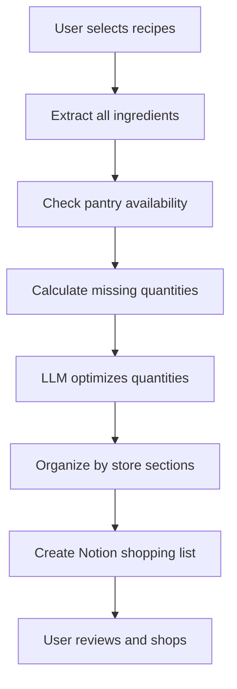
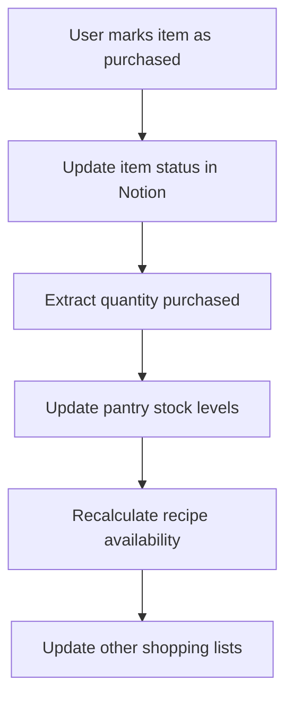

# Shopping List Generation System

## Overview
The Shopping List Generation System automatically creates and manages purchase lists based on recipe needs versus current pantry stock. It integrates seamlessly with the pantry management system to provide intelligent shopping assistance.

## Core Functionality

### 1. Automatic List Generation
- **Recipe-Based**: Generate lists from selected recipes
- **Pantry Analysis**: Compare needed vs available ingredients  
- **Smart Aggregation**: Combine ingredients across multiple recipes
- **Store Optimization**: Organize by store sections for efficient shopping

### 2. Dynamic Updates
- **Real-time Sync**: Updates as pantry stock changes
- **Recipe Additions**: Automatically add ingredients when new recipes are selected
- **Purchase Tracking**: Mark items as bought and update pantry
- **Cost Estimation**: Track spending and budget adherence

### 3. Intelligent Optimization
- **Quantity Optimization**: LLM-powered purchase quantity suggestions
- **Substitution Alerts**: Suggest alternatives for unavailable items
- **Bulk Opportunities**: Identify cost-saving bulk purchase options
- **Seasonal Considerations**: Factor in seasonal availability and pricing

## Database Schema

### Shopping List Database
```
Shopping List Properties:
├── List Name (Text) - "Weekly Shopping", "Recipe: Pasta Night"
├── Created Date (Date) - When list was generated
├── Status (Select) - Active, Completed, Archived
├── Total Estimated Cost (Number) - Budget tracking
├── Store (Select) - Target store for shopping
├── Notes (Rich Text) - Special instructions
└── Recipes (Relation) - Source recipes for this list

Shopping Item Properties:
├── Ingredient Name (Text) - What to buy
├── Quantity Needed (Number) - How much to purchase
├── Unit (Select) - Measurement unit
├── Store Section (Select) - Dairy, Produce, Meat, etc.
├── Priority (Select) - Essential, Important, Optional
├── Estimated Cost (Number) - Price estimate
├── Actual Cost (Number) - Real price paid
├── Purchase Status (Checkbox) - Bought or not
├── Purchase Date (Date) - When item was bought
├── Notes (Rich Text) - Brand preferences, alternatives
└── Pantry Item (Relation) - Link to pantry for stock updates
```

## Generation Algorithms

### Recipe Analysis Algorithm
```python
def generate_shopping_list(recipe_ids: List[str]) -> ShoppingList:
    """
    Generate shopping list from selected recipes
    
    Process:
    1. Extract all ingredients from recipes
    2. Aggregate identical ingredients
    3. Check pantry availability
    4. Calculate missing quantities
    5. Optimize purchase amounts
    6. Organize by store sections
    """
    
    ingredients = extract_ingredients(recipe_ids)
    aggregated = aggregate_ingredients(ingredients)
    availability = check_pantry_availability(aggregated)
    missing = calculate_missing_quantities(aggregated, availability)
    optimized = optimize_purchase_quantities(missing)
    organized = organize_by_store_sections(optimized)
    
    return create_shopping_list(organized)
```

### Smart Aggregation Logic
```python
def aggregate_ingredients(ingredients: List[Ingredient]) -> Dict[str, Ingredient]:
    """
    Combine same ingredients across multiple recipes
    
    Challenges:
    - Unit conversion (cups to ml, etc.)
    - Name variations ("all-purpose flour" vs "flour")
    - LLM-assisted matching for ambiguous cases
    """
    
    # Group by normalized ingredient name
    grouped = group_by_normalized_name(ingredients)
    
    # Convert to common units
    converted = convert_to_common_units(grouped)
    
    # Sum quantities
    aggregated = sum_quantities(converted)
    
    return aggregated
```

## LLM Integration

### Intelligent Ingredient Matching
```python
# Match recipe ingredients to standard pantry names
llm_prompt = """
Normalize these recipe ingredients to standard pantry item names:

Recipe ingredients:
- "1 cup all-purpose flour"
- "2 tbsp olive oil, extra virgin"  
- "1 lb ground beef (80/20)"

Standard pantry format:
- Name: [standard name]
- Quantity: [number]
- Unit: [standard unit]

Consider synonyms and common variations.
"""
```

### Purchase Optimization
```python
# LLM suggests optimal purchase quantities
llm_prompt = """
Optimize this shopping list:

Needed quantities:
{shopping_items}

Current pantry stock:
{pantry_levels}

Usage patterns:
{historical_usage}

Consider:
- Package sizes available in stores
- Shelf life and storage capacity
- Cost per unit optimization
- Frequency of use

Suggest optimal purchase quantities.
"""
```

### Store Section Organization
```python
# Organize items by store layout
llm_prompt = """
Organize these shopping items by store sections:

Items: {shopping_items}

Typical store sections:
- Produce
- Dairy
- Meat & Seafood  
- Frozen
- Pantry/Dry Goods
- Bakery
- Deli

Group items logically for efficient shopping route.
"""
```

## Workflow Integration

### Recipe Selection → Shopping List


### Shopping → Pantry Update


## Implementation Phases

### Phase 1: Basic Generation (Week 1)
- [ ] Create shopping list database schema
- [ ] Implement basic recipe → shopping list generation
- [ ] Add simple ingredient aggregation
- [ ] Create Notion integration for lists

### Phase 2: Smart Features (Week 2)  
- [ ] Add LLM-powered ingredient matching
- [ ] Implement quantity optimization
- [ ] Add store section organization
- [ ] Create purchase status tracking

### Phase 3: Advanced Features (Week 3)
- [ ] Implement automatic pantry updates
- [ ] Add cost tracking and budgeting
- [ ] Create list sharing capabilities
- [ ] Add purchase history analytics

### Phase 4: User Experience (Week 4)
- [ ] Mobile-optimized shopping interface
- [ ] Barcode scanning integration
- [ ] Smart notifications and reminders
- [ ] Advanced filtering and search

## API Endpoints

### List Management
```python
# Generate shopping list from recipes
POST /api/shopping/generate
Body: {
    "recipe_ids": ["recipe_123", "recipe_456"],
    "list_name": "Weekend Cooking",
    "store": "Supermarket A"
}

# Get active shopping lists
GET /api/shopping/lists?status=active

# Update shopping list
PUT /api/shopping/lists/{list_id}
Body: {
    "name": "Updated List Name",
    "notes": "Don't forget coupons"
}
```

### Item Management
```python
# Mark item as purchased
POST /api/shopping/purchase
Body: {
    "list_id": "list_123",
    "item_id": "item_456", 
    "quantity_purchased": 2,
    "actual_cost": 4.99,
    "purchase_date": "2024-01-15"
}

# Add manual item to list
POST /api/shopping/lists/{list_id}/items
Body: {
    "ingredient": "special sauce",
    "quantity": 1,
    "unit": "bottle",
    "section": "condiments",
    "priority": "optional"
}
```

## User Interface Design

### List View
- **Recipe Groups**: Show which items come from which recipes
- **Progress Tracking**: Visual progress bar of completed items
- **Cost Tracking**: Running total of estimated vs actual costs
- **Store Map**: Organize items by store layout

### Shopping Mode
- **Large Checkboxes**: Easy to tap while shopping
- **Voice Input**: Add items or mark as complete hands-free
- **Quantity Adjustments**: Quick +/- buttons for quantity changes
- **Alternative Suggestions**: Show substitutions if items unavailable

### Budget Tracking
- **Cost Estimates**: Show estimated costs per item and total
- **Budget Alerts**: Warn when approaching spending limits
- **Historical Comparison**: Compare costs over time
- **Savings Opportunities**: Highlight bulk discounts and deals

## Success Metrics

### Generation Accuracy
- **Ingredient Detection**: ≥98% correct ingredient extraction
- **Quantity Calculation**: ≥95% accurate missing quantities
- **Aggregation Success**: ≥99% correct combining of duplicate items
- **Store Organization**: ≥90% logical section grouping

### User Experience
- **List Generation Time**: <10 seconds for 5 recipes
- **Shopping Efficiency**: 30% reduction in shopping time
- **Cost Accuracy**: ±10% of actual spending
- **User Satisfaction**: ≥85% positive feedback

### System Integration
- **Pantry Sync**: ≥99% successful stock updates
- **Notion Reliability**: ≥99.5% successful syncs
- **Real-time Updates**: <2 seconds for status changes
- **Mobile Performance**: <3 seconds page load times

## Future Enhancements

### Smart Features
- **Predictive Lists**: Generate lists based on usage patterns
- **Store Integration**: Real-time pricing and availability data
- **Coupons & Deals**: Automatic deal detection and application
- **Delivery Integration**: Connect with grocery delivery services

### Social Features
- **Family Sharing**: Collaborative shopping lists
- **Community Lists**: Share lists with neighbors/friends
- **Recipe Sharing**: Include recipe links in shared lists
- **Group Shopping**: Coordinate bulk purchases with others

### Advanced Analytics
- **Spending Analysis**: Detailed cost breakdowns and trends
- **Waste Reduction**: Track unused purchases to optimize quantities
- **Seasonal Planning**: Adjust lists based on seasonal availability
- **Health Tracking**: Monitor nutritional aspects of purchases

## Technical Considerations

### Performance Optimization
- **Caching**: Cache frequently used ingredient mappings
- **Batch Processing**: Update multiple items simultaneously
- **Background Sync**: Non-blocking Notion synchronization
- **Mobile Optimization**: Lightweight mobile interface

### Data Consistency
- **Conflict Resolution**: Handle concurrent list updates
- **Rollback Capability**: Undo accidental purchases
- **Audit Trail**: Track all list modifications
- **Data Validation**: Ensure quantity and cost constraints

### Security & Privacy
- **User Data Protection**: Encrypt sensitive shopping data
- **Family Access Control**: Manage who can edit shared lists
- **Payment Integration**: Secure handling of cost information
- **Location Privacy**: Optional store location tracking

---

*This system will evolve based on user feedback and real-world usage patterns.* 