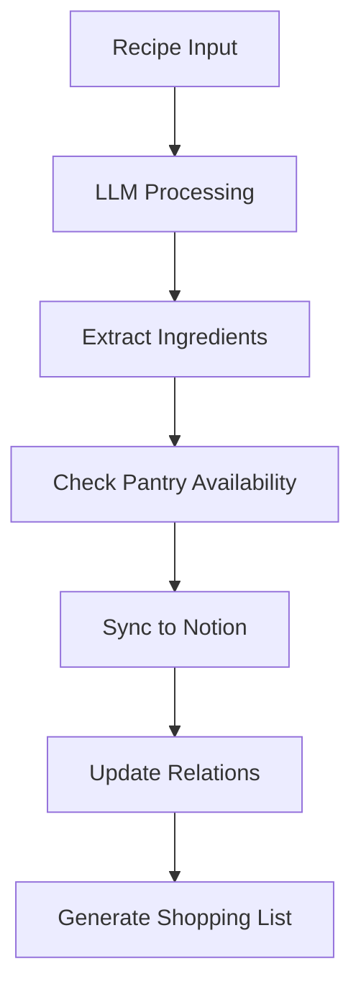

# Notion Integration Guide

## Overview

The Monthly Meal Plan system integrates with Notion to provide centralized storage for recipes, ingredients, and pantry management. This guide covers setup, database structure, and sync workflows.

## 🚀 Quick Setup

### Prerequisites
- Notion account
- Notion integration created at https://www.notion.so/my-integrations
- Integration added to your workspace with database permissions

### 1. Create Notion Integration
1. Go to https://www.notion.so/my-integrations
2. Click "New integration"
3. Name it "Monthly Meal Plan"
4. Select your workspace
5. Copy the integration token

### 2. Create Databases
Create three databases in Notion with these exact names:
- **Recetas** (Recipes)
- **Ingredientes** (Ingredients)  
- **Alacena** (Pantry)

### 3. Share Databases
1. For each database, click "Share"
2. Add your integration by name
3. Grant "Edit" permissions

### 4. Get Database IDs
1. Open each database in Notion
2. Copy the database ID from the URL (32-character string)
3. Add to your `.env` file:

```bash
NOTION_TOKEN=your_notion_integration_token
NOTION_RECETAS_DB=your_recipes_database_id
NOTION_INGREDIENTES_DB=your_ingredients_database_id
NOTION_ALACENA_DB=your_pantry_database_id
```

## 🗄️ Database Structure

### Recetas (Recipes Database)
| Field | Type | Description |
|-------|------|-------------|
| **nombre** | Title | Recipe name (Spanish) |
| **porciones** | Number | Number of servings |
| **calorias** | Number | Calories per serving |
| **ingredientes** | Relation | Links to Ingredientes database |
| **instrucciones** | Rich Text | Step-by-step instructions |
| **tiempo_preparacion** | Number | Prep time in minutes |
| **tiempo_coccion** | Number | Cook time in minutes |
| **dificultad** | Select | Easy/Medium/Hard |
| **tags** | Multi-select | Category tags |
| **fecha_agregado** | Date | Date added |
| **url_fuente** | URL | Original source |
| **notas** | Rich Text | Additional notes |
| **estado_despensa** | Formula | "Completo/Parcial/Faltante" based on pantry |

### Ingredientes (Ingredients Database)
| Field | Type | Description |
|-------|------|-------------|
| **nombre** | Title | Ingredient name |
| **cantidad** | Number | Required quantity |
| **unidad** | Select | gram/ml/cup/tbsp/tsp/unit |
| **receta** | Relation | Links to Recetas database |
| **item_alacena** | Relation | Links to Alacena database |
| **notas** | Rich Text | Substitutions or notes |

### Alacena (Pantry Database)
| Field | Type | Description |
|-------|------|-------------|
| **ingrediente** | Title | Pantry item name |
| **cantidad_disponible** | Number | Current stock quantity |
| **unidad** | Select | gram/ml/cup/tbsp/tsp/unit |
| **fecha_expiracion** | Date | Expiration date |
| **ubicacion** | Select | Pantry/Fridge/Freezer |
| **nivel_minimo** | Number | Minimum stock level |
| **estado** | Select | In Stock/Low/Out of Stock |
| **ingredientes_relacionados** | Relation | Links to Ingredientes |

## 🔄 Sync Workflows

### Recipe Processing Workflow


### Detailed Sync Steps
1. **Recipe Extraction**: LLM processes recipe from text/image/PDF
2. **Ingredient Sync**: Add/update ingredients in Ingredientes database
3. **Pantry Check**: Verify ingredient availability in Alacena database
4. **Recipe Sync**: Add/update recipe in Recetas database
5. **Relation Mapping**: Link recipes ↔ ingredients ↔ pantry items
6. **Status Update**: Update recipe pantry status (Completo/Parcial/Faltante)
7. **Shopping List**: Auto-generate missing ingredients list

### Error Handling & Recovery
- **Retry Logic**: 3 attempts with exponential backoff
- **Graceful Degradation**: Continue processing without failed syncs
- **Error Logging**: Comprehensive logging for debugging
- **Rate Limiting**: Respect Notion API limits (3 requests/second)

## 🛠️ Configuration

### Environment Variables
```bash
# Required
NOTION_TOKEN=secret_abc123...
NOTION_RECETAS_DB=abc123...
NOTION_INGREDIENTES_DB=def456...
NOTION_ALACENA_DB=ghi789...

# Optional
NOTION_RETRY_COUNT=3
NOTION_RATE_LIMIT=3
NOTION_TIMEOUT=30
```

### Database Permissions
- Integration needs "Edit" access to all databases
- Sharing must be enabled for each database
- Integration token must be kept secure

## 📊 Usage Examples

### Adding a Recipe
```bash
# CLI command
python -m core.cli process_recipe "path/to/recipe.txt"

# This will:
# 1. Process recipe with LLM
# 2. Check pantry availability
# 3. Sync to Notion
# 4. Generate shopping list if needed
```

### Checking Pantry Status
```bash
# Check what's needed for a recipe
python -m core.cli check_pantry "Arroz con Pollo"

# Output: "Faltante: arroz (500g), pollo (1kg)"
```

## 🔧 Troubleshooting

### Common Issues

**"Integration not found"**
- Verify integration token in `.env`
- Check integration is shared with databases

**"Database not accessible"**
- Verify database IDs are correct
- Check sharing permissions

**"Rate limit exceeded"**
- System handles this automatically with backoff
- Reduce concurrent operations if needed

**"Sync failed"**
- Check internet connection
- Verify Notion workspace access
- Check logs for specific error details

### Debugging
```bash
# Enable debug logging
export LOG_LEVEL=DEBUG

# Check sync status
python -m core.cli sync_status

# Manual sync
python -m core.cli force_sync
```

## 🔄 Maintenance

### Regular Tasks
- **Weekly**: Review sync logs for errors
- **Monthly**: Check database schema consistency
- **Quarterly**: Update integration permissions

### Database Backup
- Notion provides automatic backups
- Export CSV regularly for local backup
- Version control configuration changes

## 📚 Additional Resources

- [Notion API Documentation](https://developers.notion.com/)
- [Integration Best Practices](https://developers.notion.com/docs/create-a-notion-integration)
- [Rate Limiting Guidelines](https://developers.notion.com/reference/request-limits)

## 🚀 Advanced Features

### Formula Fields
The `estado_despensa` field uses a Notion formula to calculate pantry status:
```
if(length(prop("ingredientes").filter(current.prop("item_alacena").prop("estado") == "Out of Stock")) > 0, "Faltante", if(length(prop("ingredientes").filter(current.prop("item_alacena").prop("estado") == "Low")) > 0, "Parcial", "Completo"))
```

### Automation
- Set up Notion automations to notify when pantry items are low
- Create recurring tasks for pantry inventory checks
- Automate shopping list generation based on meal plans 