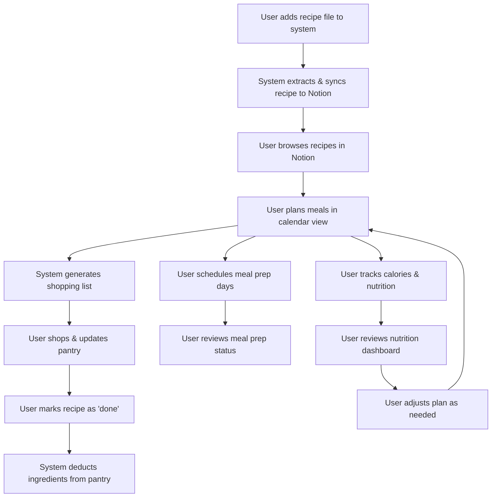

# Project Technical Summary for LLMs

## 1. Project Overview
- **Name:** Monthly Meal Plan
- **Purpose:** An automated recipe management and meal planning system that digitizes, organizes, and plans meals. It processes recipes from various formats, manages pantry inventory, and generates smart shopping lists, all integrated with Notion.
- **Key Technologies:** Python, Notion API, OCR (Tesseract), pdfplumber, httpx, async/await, dataclasses.

## 2. High-Level Architecture
- **Main Components:**
  - **Extraction Layer:** Extracts text from PDFs, images, and text files.
  - **Recipe Processing Layer:** Parses, normalizes, and structures recipe data.
  - **Notion Integration Layer:** Syncs recipes, ingredients, and pantry data to Notion databases, including content blocks.
  - **Storage Layer:** Manages local file storage and moves processed/failed files.
  - **Utils Layer:** Handles logging, configuration, error handling, and metrics.

- **Data Flow:**
  1. User adds a recipe file to `recetas/sin_procesar/`.
  2. CLI command processes the file: extraction → parsing → normalization.
  3. Structured data is synced to Notion (recipes, ingredients, pantry).
  4. File is moved to `recetas/procesadas/` (or `errores/` if failed).

## 3. Key Modules & Their Roles (Expanded)

- **core/extraction/**
  - **Purpose:** Extracts raw text from various recipe file formats (PDF, image, plain text).
  - **Key Files:**
    - `pdf.py`: Extracts text from PDFs using pdfplumber; handles both text and image-based PDFs.
    - `ocr.py`: Uses Tesseract OCR to extract text from images or image-based PDFs.
    - `text.py`: Reads and returns text from plain text files.
    - `interface.py`: Defines a common interface (`IExtractor`) for all extractors, ensuring consistent method signatures.
  - **Patterns:** Strategy pattern for extractor selection based on file type.

- **core/recipe/**
  - **Purpose:** Parses, normalizes, and structures recipe data into standardized models.
  - **Key Files:**
    - `models/`: Contains dataclasses for `Recipe`, `Ingredient`, and `RecipeMetadata`.
    - `extractors/`: 
      - `sections.py`: Extracts logical sections (ingredients, instructions, metadata) from raw text.
      - `ingredients.py`: Parses ingredient lines into structured data.
      - `metadata.py`: Extracts metadata (title, portions, calories, etc.) from text.
    - `normalizers/`: 
      - `ingredients.py`: Normalizes ingredient names, quantities, and units.
      - `measurements.py`: Standardizes measurement units.
      - `text.py`: Cleans and normalizes free text fields.
    - `processor.py`: Orchestrates the full pipeline: section extraction → ingredient/metadata extraction → normalization → model assembly.
  - **Patterns:** Modular, class-based extractors and normalizers for easy extension and testing.

- **core/notion/**
  - **Purpose:** Handles all communication and synchronization with Notion databases.
  - **Key Files:**
    - `client.py`: Manages Notion API authentication, request sending, and error handling.
    - `sync.py`: Maps internal models to Notion DB properties, creates/updates pages, manages relations, and adds content blocks.
    - `models.py`: Defines Notion-specific data models (e.g., `NotionRecipe`, `NotionIngredient`).
  - **Patterns:** Adapter pattern for mapping internal models to Notion API payloads; async/await for performance.

- **core/cli.py**
  - **Purpose:** Main entry point for batch processing recipes via the command line.
  - **Key Functions:**
    - `process_recipes()`: Loops through files in `recetas/sin_procesar/`, processes each, syncs to Notion, and moves files to the appropriate directory.
    - Handles logging, error reporting, and summary output.
  - **Patterns:** Command pattern (Click-based CLI), robust try/except/finally for file movement.

- **core/utils/**
  - **Purpose:** Provides shared utilities for configuration, logging, metrics, and error handling.
  - **Key Files:**
    - `config.py`: Loads and manages environment/configuration variables.
    - `logger.py`: Sets up structured logging for all modules.
    - `metrics.py`: Collects and reports performance metrics.
    - `errors.py`: Defines custom exceptions and error handling utilities.

## 4. Data Models (Expanded)

- **Recipe** (`core/recipe/models/recipe.py`)
  - **Fields:**
    - `title: str` — Recipe title
    - `ingredients: List[Ingredient]` — List of ingredient objects
    - `instructions: List[str]` — Step-by-step instructions
    - `metadata: RecipeMetadata` — Metadata object (see below)
    - `source: Optional[str]` — Source or URL of the recipe
    - `created_at: datetime` — Timestamp of creation
    - `updated_at: datetime` — Timestamp of last update

- **Ingredient** (`core/recipe/models/ingredient.py`)
  - **Fields:**
    - `name: str` — Ingredient name (normalized)
    - `quantity: Union[int, float, str, None]` — Amount used (may be string for fractions/ranges)
    - `unit: Optional[str]` — Measurement unit (normalized)
    - `pantry_id: Optional[str]` — Notion ID for pantry relation
    - `notes: Optional[str]` — Additional notes or preparation details

- **RecipeMetadata** (`core/recipe/models/metadata.py`)
  - **Fields:**
    - `title: str` — Recipe title (redundant for convenience)
    - `url: Optional[str]` — Source URL
    - `porciones: Optional[int]` — Number of servings
    - `calorias: Optional[int]` — Calories per serving
    - `tipo: Optional[str]` — Recipe type/category
    - `tags: List[str]` — List of tags (e.g., "vegetarian", "quick")
    - `hecho: bool` — Whether the recipe has been made
    - `date: Optional[str]` — Date of creation or last made
    - `dificultad: Optional[str]` — Difficulty level
    - `tiempo_preparacion: Optional[int]` — Prep time (minutes)
    - `tiempo_coccion: Optional[int]` — Cook time (minutes)
    - `tiempo_total: Optional[int]` — Total time (minutes)
    - `notas: Optional[str]` — Additional notes

- **NotionRecipe / NotionIngredient / NotionPantryItem** (`core/notion/models.py`)
  - **Purpose:** Internal representations for mapping to Notion API payloads.
  - **Fields:** Mirror the above models, with additional Notion-specific fields (e.g., Notion page IDs, relation IDs).

## 5. Notion Integration (Expanded)

- **Databases:**
  - **Recetas (Recipes):** Main recipe info, relations to ingredients.
  - **Ingredientes:** Per-recipe ingredient usage, relations to pantry and recipes.
  - **Alacena (Pantry):** Master ingredient list, stock tracking.
  - **Lista de Compras:** Shopping list, linked to pantry.

- **Property Mapping Table:**

| Notion DB      | Property Name      | Type        | Model Field         | Notes/Mapping                        |
|---------------|-------------------|-------------|---------------------|--------------------------------------|
| Recetas       | Nombre            | Title       | Recipe.title        | Recipe name                          |
| Recetas       | Porciones         | Number      | RecipeMetadata.porciones | Number of servings              |
| Recetas       | Calorías          | Number      | RecipeMetadata.calorias  | Calories per serving              |
| Recetas       | Tipo              | Select      | RecipeMetadata.tipo      | Recipe type/category               |
| Recetas       | Tags              | Multi-select| RecipeMetadata.tags      | List of tags                       |
| Recetas       | Hecho             | Checkbox    | RecipeMetadata.hecho     | Completion status                  |
| Recetas       | Date              | Date        | RecipeMetadata.date     | Date of creation/last made         |
| Recetas       | Ingredientes      | Relation    | ingredient_ids           | Linked to Ingredientes DB          |
| Ingredientes  | Cantidad Usada    | Title       | Ingredient.quantity      | Only the quantity                  |
| Ingredientes  | Unidad            | Text        | Ingredient.unit          | Measurement unit                   |
| Ingredientes  | Ingrediente       | Relation    | Ingredient.pantry_id     | Linked to Alacena DB               |
| Ingredientes  | Receta            | Relation    | receta_id               | Linked to Recetas DB               |
| Alacena       | Nombre            | Title       | Ingredient.name          | Pantry item name                   |
| Alacena       | Categoría         | Select      | Ingredient.category      | Ingredient category                |
| Alacena       | Stock alacena     | Number      | Ingredient.stock         | Current stock level                |
| Alacena       | Unidad            | Select      | Ingredient.unit          | Measurement unit                   |
| Lista de Compras | Producto        | Title       | -                       | Shopping list item                 |
| Lista de Compras | Cantidad        | Number      | -                       | Amount needed                      |
| Lista de Compras | Categoría       | Select      | -                       | Shopping category                  |
| Lista de Compras | Comprado        | Checkbox    | -                       | Purchase status                    |

- **Relations:**
  - **Recetas → Ingredientes:** Each recipe links to its ingredient rows in the Ingredientes DB via the `Ingredientes` relation.
  - **Ingredientes → Recetas:** Each ingredient row links back to its parent recipe via the `Receta` relation.
  - **Ingredientes → Alacena:** Each ingredient row links to the pantry item in Alacena via the `Ingrediente` relation.
  - **Alacena → Lista de Compras:** Pantry items with low stock can trigger shopping list entries.

- **Sync Logic:**
  - Properties are mapped from internal models to Notion DB fields using mapping functions in `core/notion/sync.py`.
  - When creating or updating a recipe, the system:
    1. Syncs/creates pantry items in Alacena for each ingredient.
    2. Syncs/creates ingredient rows in Ingredientes, linking to both the recipe and pantry item.
    3. Creates/updates the recipe page in Recetas, linking to all ingredient rows.
    4. Adds content blocks (title, metadata, ingredients, instructions, notes) to the recipe page using the Notion API's `children` parameter.
  - All Notion API calls are async and include error handling and retries.

- **Known Limitations & Gotchas:**
  - **Rate Limits:** Notion API allows 3 requests/second per integration; batching and async logic are used to avoid throttling.
  - **Property Name Mismatches:** Notion property names must match exactly (case and accents) or sync will fail.
  - **Content Block Limits:** Notion has a limit on the number of blocks per page; very large recipes may need special handling.
  - **Manual Intervention:** If a sync fails, the file is moved to `errores/` and must be retried manually.
  - **Dual-Language Support:** Ingredient and recipe names are normalized for both Spanish and English, but some edge cases may require manual correction.

## 6. Error Handling & File Movement

- If processing or sync fails, file is moved to `recetas/errores/` and error is logged.
- Success: file is moved to `recetas/procesadas/`.

## 7. Key Conventions & Patterns

- All models use Python dataclasses with type hints.
- Extraction and normalization are modular and testable.
- Notion sync is designed for extensibility (easy to add new properties/relations).
- Async/await is used for performance in Notion sync.
- Logging is structured and covers all major operations.

## 8. Example Workflow

1. User adds `pasta.txt` to `recetas/sin_procesar/`.
2. Runs: `python -m core.cli process-recipes`
3. System extracts, parses, normalizes, and syncs data to Notion.
4. Notion page is created with all recipe info and content blocks.
5. File is moved to `recetas/procesadas/`.

## 9. Unique Features or Gotchas

- Dual-language (Spanish/English) support for recipes and ingredients.
- Handles both text and image-based recipes (OCR).
- Modular design for easy extension.
- Batch and async processing for performance.
- Error files are not retried automatically—manual intervention may be needed.

## 10. Example Notion Recipe Page Structure

A fully synced Notion recipe page is structured as follows:

- **Header:** Recipe title (with emoji, if present)
- **Metadata:** Portions, calories, difficulty, prep/cook/total time (as a paragraph or table)
- **Ingredients:** Bulleted list of ingredients (with quantities and units)
- **Preparation Steps:** Numbered list of instructions
- **Notes/Variations:** Bulleted list or paragraph
- **(Optional) Additional Sections:** Nutrition table, storage tips, variations, etc.

**Example (Markdown-style):**
```
# 🥘 Pasta con Albóndigas

Porciones: 4  
Calorías: 450 kcal  
Dificultad: Media  
Tiempo de preparación: 15 min  
Tiempo de cocción: 10 min  
Tiempo total: 25 min  

## 🧾 Ingredientes
- 200g pasta
- 1 huevo
- 400g carne molida
...

## 🔪 Preparación
1. Mezclar la carne molida con el huevo, ajo picado, cebolla picada y pan rallado
2. Formar albóndigas pequeñas
...

## 💡 Notas
- Se puede usar carne de pollo en lugar de carne molida
- Agregar hierbas frescas para más sabor
```

## 11. Rollups in Notion

**What are Rollups?**
- Rollups in Notion are properties that aggregate or summarize data from related database entries via relations. They allow users to see summaries (e.g., lists, counts, sums) of related data directly in a Notion page or database view.

**How We Use Rollups:**
- Rollups are configured in Notion to display or summarize information from related databases. For example, a recipe page can show a list of all ingredient names (from the Ingredientes DB) or sum up nutritional values.

**Rollup Mapping Table:**

| Notion DB | Rollup Name         | Source Relation   | Aggregated Property | Purpose/Display                |
|-----------|---------------------|------------------|---------------------|-------------------------------|
| Recetas   | Ingredient Names    | Ingredientes     | Name                | Show all ingredient names      |
| Recetas   | Total Calories      | Ingredientes     | Calories            | Sum calories for the recipe    |
| Alacena   | Used In Recipes     | Ingredientes     | Receta (relation)   | List all recipes using item    |

**Example:**
- On a Recetas (Recipe) page, the "Ingredient Names" rollup displays a comma-separated list of all ingredient names linked via the Ingredientes relation.
- The "Total Calories" rollup can sum the calories from all related ingredient rows, giving a quick nutritional overview.
- On an Alacena (Pantry) page, the "Used In Recipes" rollup lists all recipes that use that pantry item.

**Limitations & Gotchas:**
- Rollups only work if relations are set correctly during sync; missing or broken relations will result in empty or incomplete rollups.
- Notion API does not allow direct creation or configuration of rollup properties—these must be set up manually in the Notion UI.
- Rollup updates may be delayed if Notion is still indexing new or updated relations.
- Some rollup types (e.g., sum, count) require the aggregated property to be the correct type (number, text, etc.).

## 12. Content Block Mapping Table (Expanded)

| Recipe Section   | Notion Block Type | Example/Notes                |
|------------------|------------------|------------------------------|
| Title            | Heading 1        | Emoji + recipe name          |
| Metadata         | Paragraph        | Portions, calories, etc.     |
| Ingredients      | Bulleted list    | Each ingredient as a bullet  |
| Preparation      | Numbered list    | Each step as a list item     |
| Notes            | Bulleted list    | Each note as a bullet        |
| Nutrition Table  | Table            | (Optional)                   |
| Variations       | Bulleted list    | (Optional)                   |

## 13. Supported Input Formats

- **Currently Supported:**
  - `.txt` (plain text recipe files)
- **Planned/Extensible:**
  - `.pdf` (PDF extraction, including OCR for image-based PDFs)
  - `.jpg`, `.png` (image files, via OCR)
  - `.md` (Markdown)
- **Edge Cases:**
  - Multi-page PDFs (planned)
  - Mixed-language recipes (partial support)
  - Recipes missing sections (handled with defaults or error reporting)

## 14. How to Add/Extend a Feature

- **To add a new extractor (e.g., for a new file type):**
  1. Implement a new class in `core/extraction/` that inherits from `IExtractor`.
  2. Register the extractor in the extraction selection logic.
- **To add a new normalizer:**
  1. Create a new class in `core/recipe/normalizers/`.
  2. Integrate it into the normalization pipeline in `processor.py`.
- **To add a new Notion property or relation:**
  1. Update the relevant data model in `core/recipe/models/` or `core/notion/models.py`.
  2. Add mapping logic in `core/notion/sync.py`.
  3. Update Notion DB schema manually to match.
- **To support a new input format:**
  1. Add extraction logic for the new format.
  2. Add tests and update documentation.

## 15. API Rate Limiting & Performance Tips

- **Notion API Rate Limits:** 3 requests/second per integration; 30 requests per bucket.
- **Best Practices:**
  - Use async/await and batching to maximize throughput without exceeding limits.
  - Monitor for rate limit errors and implement exponential backoff.
  - Configure concurrency via environment variables if needed.
  - Use logging to track API usage and performance bottlenecks.
- **Performance Tips:**
  - Profile extraction and sync steps to identify slow points.
  - Use caching for repeated lookups (e.g., pantry items).
  - Minimize unnecessary API calls (e.g., only update changed fields).

## 16. Testing and Validation

- **Unit Tests:**
  - Test extractors, normalizers, and Notion sync logic in isolation.
- **Integration Tests:**
  - End-to-end tests for full recipe processing and Notion sync.
  - Use mocks for Notion API to avoid hitting real endpoints during CI.
- **Validation:**
  - Check that all required fields are present and correctly mapped.
  - Validate that Notion pages are created with the expected structure and content blocks.
- **Manual Review:**
  - Periodically review Notion pages for formatting and data integrity.

## 17. Future-Proofing & Extensibility

- **Planned Enhancements:**
  - Add support for PDF extraction (including OCR for image-based PDFs).
  - Add support for image file extraction (JPG, PNG, etc.).
  - Expand language support and improve mixed-language handling.
  - Add more advanced Notion features (e.g., rollups, advanced relations, analytics).
  - Support for new recipe formats (Markdown, web scraping, etc.).
- **Extensibility:**
  - Modular extractor and normalizer design makes it easy to add new formats or processing steps.
  - Notion sync logic is designed for easy addition of new properties and relations.
  - Async/await and batching logic support scaling to larger recipe batches and more complex workflows.
- **OCR & PDF Support:**
  - OCR and PDF extraction are planned and partially scaffolded; see `core/extraction/ocr.py` and `core/extraction/pdf.py` for details.

## 18. User Experience & Journey

### User Personas & Goals
- **Primary Users:** Busy professionals, families, health-conscious individuals, meal preppers.
- **Main Goals:**
  - Improve meal planning and organization
  - Save time and reduce food waste
  - Eat healthier and track nutrition
  - Simplify shopping and pantry management
  - Batch cook and plan meal prep days

### User Journey (Step-by-Step)
1. **Recipe Collection:** User finds or creates recipes (from web, family, etc.).
2. **Recipe Import:** User adds recipes (TXT for now, later PDF/image) to the system.
3. **Recipe Processing:** System extracts, normalizes, and syncs recipes to Notion, including all metadata, ingredients, and instructions.
4. **Recipe Browsing:** User browses recipes in Notion, sees all details, and can filter/search by tags, calories, etc.
5. **Meal Planning:** User drags recipes into a calendar view for each meal slot (breakfast, lunch, snack, dinner) for the month.
6. **Calorie Tracking:** User sees daily/weekly/monthly calorie totals (via rollups or Notion formulas).
7. **Shopping List Generation:** System automatically generates and updates a shopping list based on planned meals and current pantry stock.
8. **Pantry Management:**
   - User checks off items as purchased; system updates pantry stock.
   - **When a recipe is marked as "done," the system automatically deducts the used ingredients from the pantry stock.**
9. **Meal Prep Planning:** User identifies meal prep days, batches recipes, and sees which meals are ready to go.
10. **Review & Adjust:** User reviews plan, makes adjustments, and repeats the cycle.

### Key User-Facing Features
- **Recipe Page:** All recipe info, ingredients, instructions, notes, nutrition, and links to pantry items.
- **Calendar View:** Visual meal plan for the month, with color coding for meal types and easy drag-and-drop.
- **Shopping List:** Always up-to-date, grouped by store section/category, with checkboxes for purchased items.
- **Pantry View:** See what's in stock, what's low, and what's needed for upcoming meals.
- **Nutrition Dashboard:** Calorie and macro tracking per day/week/month.
- **Meal Prep Tools:** Batch cooking suggestions, prep day scheduling, and leftovers tracking.

### Future/Planned User Experience Enhancements
- **Mobile Optimization:** Easy access to shopping list and meal plan on the go.
- **Recipe Sharing:** Share meal plans or recipes with family/friends.
- **Personalization:** Smart suggestions based on dietary preferences, past meals, or seasonal ingredients.
- **Notifications:** Reminders for shopping, meal prep, or expiring pantry items.

### Additional Notes
- **Accessibility:** Plans for color contrast, screen reader support, and mobile-friendly design.
- **Multi-language Support:** Users can work in Spanish/English; system handles mixed-language recipes.
- **Manual Overrides:** Users can manually edit recipes, shopping lists, or pantry items in Notion if needed.
- **Error Handling:** If a recipe fails to import, the user is notified and can fix or retry.
- **User Feedback Loop:** Users can report issues, suggest features, or get help via documentation or support channels.

### User Journey Diagram



## 12. Real-World Example: Complex Recipe End-to-End

**Input:**
File: `recetas/sin_procesar/test_12_complex_format.txt`
```
Risotto de Champiñones y Lentejas
Porciones: 4-6
Calorías: 380 por porción
Tiempo de preparación: 20 minutos
Tiempo de cocción: 45 minutos
Dificultad: Media

INGREDIENTES PRINCIPALES:
- 1 1/2 tazas de arroz arborio (300g)
- 1 taza de lentejas (200g)
- 400g de champiñones frescos
- 200g de chorizo español, en rodajas
- 1 cebolla mediana
- 2 dientes de ajo
- 1/2 taza de vino blanco seco
- 5 tazas de caldo de verduras
- 1/2 taza de queso parmesano rallado
- 2 cucharadas de mantequilla
- 2 cucharadas de aceite de oliva
- Sal y pimienta al gusto

INGREDIENTES OPCIONALES:
- 1/4 taza de crema de leche
- 1 cucharada de perejil picado
- 1 cucharadita de tomillo fresco
- 1 cucharadita de pimentón dulce

PREPARACIÓN:
1. Preparar el caldo y mantener caliente
2. Limpiar y cortar los champiñones en láminas
3. Picar finamente la cebolla y el ajo
4. En una olla grande, calentar el aceite y la mantequilla
5. Agregar la cebolla y cocinar hasta transparente
6. Incorporar el ajo, chorizo y champiñones
7. Agregar el arroz y tostar ligeramente
8. Verter el vino y dejar evaporar
9. Agregar las lentejas y el caldo poco a poco
10. Revolver constantemente hasta que el arroz esté al dente
11. Incorporar el queso parmesano y rectificar la sazón

VARIACIONES:
1. Versión Vegetariana:
   - Omitir el chorizo
   - Usar caldo de verduras casero
   - Agregar 1 taza de espinacas al final
2. Versión de Mariscos:
   - Reemplazar champiñones por 300g de mariscos mixtos
   - Agregar 1 cucharadita de azafrán al caldo
   - Usar caldo de pescado
3. Versión Especial:
   - Agregar 1 cucharadita de aceite de trufa
   - Decorar con láminas de trufa fresca
   - Usar caldo de carne

CONSEJOS DE COCINA:
- El caldo debe estar caliente al agregarlo
- Revolver constantemente para liberar el almidón
- Probar el arroz frecuentemente para el punto perfecto
- Dejar reposar 2 minutos antes de servir
- Las lentejas no necesitan remojo previo, pero mejora la textura
- Se puede usar chorizo mexicano si no se encuentra el español

INFORMACIÓN NUTRICIONAL:
- Proteínas: 22g
- Carbohidratos: 48g
- Grasas: 12g
- Fibra: 8g
- Sodio: 800mg

ALMACENAMIENTO:
- Refrigerar: Hasta 3 días
- Congelar: No recomendado
- Recalentar: A fuego lento con un poco de caldo

ACOMPAÑAMIENTOS SUGERIDOS:
- Ensalada verde simple
- Pan crujiente
- Vino blanco seco
- Queso parmesano rallado adicional

NOTAS ADICIONALES:
- El plato sabe mejor al día siguiente
- Se puede preparar con anticipación y recalentar
- Ajustar la cantidad de caldo según la textura deseada
- Se puede agregar más verduras según preferencia
```

**Processing Steps:**
1. Place the file in `recetas/sin_procesar/`.
2. Run the CLI: `python -m core.cli process_recipes`.
3. The system extracts metadata, ingredients (main and optional), instructions, variations, tips, nutrition, storage, and notes.
4. Ingredients are normalized and cross-referenced with the pantry (Alacena) DB.
5. The recipe and all ingredients are synced to Notion, with relations and rollups established.
6. The Notion page is formatted with:
   - Title and metadata block
   - Bulleted lists for ingredients (main/optional)
   - Numbered list for preparation
   - Collapsible sections for variations, tips, nutrition, storage, and notes
   - Linked ingredients and pantry items

**Output:**
- In Notion, a new page appears in the Recetas DB:
  - Title: "Risotto de Champiñones y Lentejas"
  - Metadata: Porciones, Calorías, Dificultad, Tiempos
  - Ingredients: Each as a bulleted list, with relations to Ingredientes and Alacena DBs
  - Preparation: Numbered steps
  - Variations, tips, nutrition, storage, and notes as collapsible or separate sections
  - All ingredient quantities and units are normalized and linked
  - Rollups show total calories, pantry stock, and related recipes

## 13. Configuration & Environment

**Environment Variables:**
- `NOTION_TOKEN`: Notion integration token
- `NOTION_RECIPE_DB`: Notion Recetas database ID
- `NOTION_INGREDIENTS_DB`: Notion Ingredientes database ID
- `NOTION_PANTRY_DB`: Notion Alacena (pantry) database ID
- `NOTION_SHOPPING_LIST_DB`: Notion Shopping List database ID
- `LOG_LEVEL`: Logging level (e.g., INFO, DEBUG)
- `ENVIRONMENT`: Environment name (development, production, etc.)
- `ENABLE_PERFORMANCE_LOGGING`: Enable/disable performance logs
- `CACHE_ENABLED`: Enable/disable caching
- `TESSERACT_PATH`: Path to Tesseract OCR binary
- `OCR_LANGUAGE`: OCR language(s), e.g., `spa+eng`

**Configuration Files:**
- `.env`: Main environment variable file (never commit secrets)
- `core/utils/config.py`: Central config constants and helpers
- `requirements.txt`, `requirements-dev.txt`: Dependency management
- `.pre-commit-config.yaml`: Linting, formatting, and commit hooks
- `.vscode/settings.json`: Editor config (optional)

**Setup Steps:**
1. Install system dependencies (Python 3.13, Tesseract, Poppler, etc.)
2. Create and activate a Python virtual environment
3. Install Python dependencies (`pip install -r requirements.txt`)
4. Copy `.env.example` to `.env` and fill in your values
5. Run `pre-commit install` for code quality hooks
6. Use the CLI or Docker for running the system

**Security & Permissions:**
- API tokens and sensitive files should have permissions set to `600`
- Token rotation and audit logging are supported (see `core/utils/security.py`)
- Input validation and sanitization are enforced for recipe data

**Deployment:**
- Dockerfile provided for containerized deployment
- Environment variables can be set via `.env` or Docker/Kubernetes secrets 